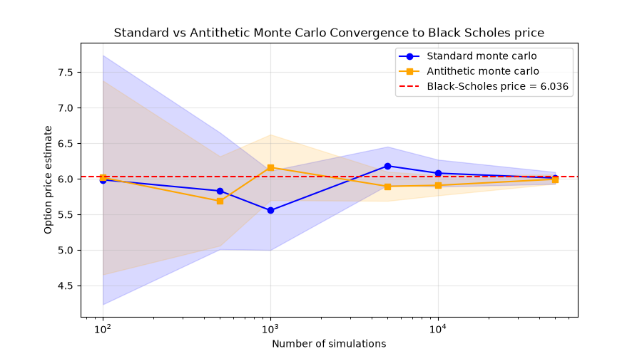

European call option pricing - Monte Carlo vs Black-Scholes
## What is this?
This project prices a European call option using Monte Carlo simulation of Geometric Brownian Motion (GBM) and confirms the result against the Black-Scholes model which gives the exact answer under the same assumptions. It also makes use of antithetic variates, one of the 2 well known variance reduction techniques to show how the same simulation can be more efficient. A summary of how to run this code is given below.
## How it actually works-
1. Simulation - the asset is modelled under GBM , discretized into daily steps via the Euler-Maruyama method with each path representing a possible outcome of the stock price.
2. Computation - for each simulated path, the option payoff at expiry is calculated by max(S_T -K,0) where S_T is the stock price and K is the strike price
3. Average & Discount -the mean payoff from each simulated path is calculated and discounted back to todays value (not the price in a year) using the risk-free interest rate and so we have our Monte Carlo estimate
4. Compare - the same option is priced using the Black-Scholes formula which gives the exact truth to check the simulation converges correctly
## Graph-

The convergence plot shows how the Monte Carlo estimate tends towards the Black-Scholes answer as the number of estimations increase from 100 to 50,000 thus clearly illustrating and exemplifying the Law of Large Numbers - the greater the number of samples averaged, the closer the sample mean is to the true answer. 
The shaded region around the Monte Carlo graph represents the 95% confidence interval which stems from the standard error, as the number of simulations increase the standard error decreases , since standard error scales with 1/root n (Quadrupling simulations, halves uncertainty) 
## How to run this code-
You will need some form of python engine installed (personally use Pycharm community edition)
- numpy - for vectorised path calculations
-  scipy - for cumulative normal distribution (CND) that is used in the Black-Scholes formula.
-  matplotlib - for the graph
## Assumptions-
This project uses standard assumptions which confine reality in the following ways: 
- European-style only, this project covers options that are priced at expiry not before like American ones allow
- Volatility is constant - real markets have changing volatilities
- No dividends - the asset is assumed to pay no dividends over the options life which would affect the calculations

